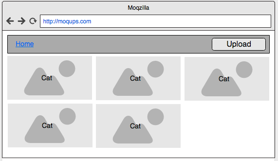

# Vue スプリント
### This was created during my time as a [Code Chrysalis](https://codechrysalis.io) Student

## 目次

1.  [導入](#導入)
1.  [目的](#目的)
1.  [環境](#環境)
1.  [要件](#要件)
1.  [依存パッケージのインストール](#依存パッケージのインストール)
1.  [要件と説明](#要件と説明)
1.  [基本演習](#基本演習)
1.  [上級演習](#上級演習)
1.  [参考資料](#参考資料)
1.  [コントリビューション](#コントリビューション)

## 導入

いまなお人気の高い React や Angular に代わるフロントエンドのフレームワークとして、急速に知名度を獲得しつつある Vue にチャレンジしてみましょう。このフレームワークは、双方向データバインディングや、他のアプリケーションへの導入が容易な点などでよく知られています。

## 目的

この課題の目的は、以下の通りです。

- ドキュメントを用いながら、新たなフレームワークについて学習する
- フロントエンドフレームワーク同士の共通点や相違点についてはっきりと説明できるようになる
- Vue の単一ファイルコンポーネントを利用して写真をアップロードするアプリを開発する
- Vue のアーキテクチャの基礎をおさえて、コンポーネントを作成し、ライフサイクルメソッドを作り、データを渡す

## 環境

### 要件

- Node.js

### 依存パッケージのインストール

この課題の依存パッケージをインストールするためには、

```shell
  $ yarn
```

ESLint を実行するには、

```shell
  $ yarn lint
```

単体テストを実行するには、

```shell
  $ yarn test:unit
```

ホットリロードを利用して開発環境でアプリを実行するには、

```shell
  $ yarn dev
```

本番用のビルドファイルを作り、簡易サーバーを立ち上げるには、

```shell
  $ yarn start
```

## 要件と説明

### 基本演習

この演習では、React で作り上げた写真をアップロードするアプリを、Vue で作り直してもらいます。結果としてみなさんは、React のときと同じ 5 つのコンポーネント、App、Navbar、Upload、AllPhotos、そして SinglePhoto を複製することになります。

フレームワークについていろいろと調べる際は、[Vue のドキュメント](https://vuejs.org/v2/guide/) を利用してください。新たなテクノロジーやフレームワークの学習は、今後 _避けては通れない_ ので、今回の演習問題はドキュメントを読む力の向上も意図して作られています。

この Vue のアプリでは、[単一ファイルコンポーネント](https://vuejs.org/v2/guide/single-file-components.html)を利用することにも注意してください。リンク先の説明をしっかり読み、React との書き方の違いを理解するようにしてください。アプリの骨組みのほとんどは、もうみなさんのために用意してあります。

各コンポーネントからなるヒエラルキーは、大体次のような形をとるはずです。

```
  App
    Navbar
      Upload
    AllPhotos/SinglePhoto
```

#### App

このコンポーネントは、今回の Vue アプリでもっとも大事なエントリーポイントになります。

ここでは次の 3 つのデータを格納します。

- [ ] `currentView` は文字列で、ユーザーが AllPhotos と SinglePhoto のどちらの view 層を見ているのかをコンポーネントに伝える役割を果たします。
- [ ] `photos` は、画像を Base64 文字列で表した各要素からなる配列です。
- [ ] `selectedPhoto` は、Base64 文字列で表した 1 枚の画像のことです。

このコンポーネントは、その他全てのコンポーネントをレンダリングするためにも必要になります。

- [ ] **Navbar** は、ユーザーのためにナビゲーションバーをレンダリングします。Navbar は、view 層にかかわらず、つねに表示されます。
- [ ] **AllPhotos** または **SinglePhoto** は、網目上に配置された全画像、あるいは大きく引き伸ばされた単一の写真を表示するコンポーネントになります。このレンダリングは、**App** コンポーネントの `currentView` プロパティに基づいて、条件分岐的に行われます。みなさんのアプリのテンプレート内でどのようにレンダリングの条件分岐を行うかは、[Vue のドキュメント](https://vuejs.org/v2/guide/conditional.html)を参照してください。

デフォルトでは、**App** は **AllPhotos** コンポーネントを表示するようにしてください。

**App** コンポーネントがマウントされたら、つづいて次のようなことが起こります。

- [ ] `created` メソッドを実行することで、Vue のライフサイクルを中断させてください。 [Vue のライフサイクルについてはこちらを読んでください](https://alligator.io/vuejs/component-lifecycle/)。このメソッドの内部では、**utils/index.js** ファイルに書かれているユーティリティ・メソッドを利用して Amazon の S3 サービスにアクセスし、あらかじめ用意された S3 バケット上の画像データをすべて取り出してきてください。
- [ ] それが終わったら、それぞれの画像をコンポーネントのデータオブジェクト内にある `photos` という配列に格納してください。

#### Navbar

このコンポーネントは、いま作っている Vue のアプリのナビゲーションバーとして機能させてください。Upload コンポーネントとともに、タイトルをレンダリングすることになります。

- [ ] タイトルは、クリック可能なエレメントであり、クリックすると **App** コンポーネントの data の中にある文字列 `currentView` の値を `AllPhotos` に変更します。これで、ユーザーは再び AllPhotos の view 層を見ることができるようになります。この動きを作るために、Vue のドキュメントの[イベント](https://vuejs.org/v2/guide/components.html#Sending-Messages-to-Parents-with-Events)について確認しておきましょう。
- [ ] NavBar は、Upload コンポーネントもレンダリングしなければいけません。このコンポーネントは、送られてきたファイルを引数として受け取り、**utils/index.js** の中にあるユーティリティ・メソッドの一つを使うことで、そのファイルを S3 に保存する役目を果たします。その結果として、**App** コンポーネントの state に保存された配列 photos も更新されることになります。

#### Upload

- [ ] Upload コンポーネントは、1 枚の画像をアップロードするのに必要な、`button` エレメントをレンダリングします。
- [ ] `input` エレメントは、ユーザーが画像ファイルを 1 つ選択するために使われます。
- [ ] `input` エレメントで画像ファイルが選択されると、最終的にそのファイルは S3 バケットに保存されることになります。
- [ ] コンポーネント内にある `button` エレメントを用いることで、見えない `input` エレメントのクリックイベントを発火させてください。この機能を作るために、Vue のドキュメントの [イベント・ハンドリング](https://vuejs.org/v2/guide/events.html)を参照してください。

#### AllPhotos

- [ ] このコンポーネントは、Base64 文字列からなる配列を prop として持ち、それに基づいて画像を網目上にレンダリングします。
- [ ] 画像は、フルスクリーンで表示してはいけません！　ほどよい大きさにして、網目上に表示されていることがわかるようにしてください。
- [ ] 文字列から成るこの配列は、親の **App** コンポーネントから data として受け渡されるようにしてください。
- [ ] それぞれの画像はクリック可能であり、クリックした際は、クリックした画像を **App** コンポーネントに送り返す関数を実行してください。
- [ ] 個別の画像がクリックされると、**App** コンポーネントのレンダリングが **AllPhotos** コンポーネントではなく、 **SinglePhoto** コンポーネントを表示するように設定してください。

#### SinglePhoto

- [ ] このコンポーネントは、1 舞の画像をフルスクリーンで表示するためのものです！
- [ ] レンダリングされた画像は、**App** コンポーネントから prop として渡されるようにしてください。

#### ワイヤフレーム

- All Photos:



- Single Photo:


### 上級演習

- [ ] 写真がアップロードされている際に表示する、プログレスバーかオーバーレイを加え、アップロードが完了した際には消えるようにしてください。
- [ ] ステート管理をするために Vuex を加えてください。これは Vue 専用の Redux のようなものです。[詳細はこちら！](https://vuex.vuejs.org/guide/)
- [ ] Vue のテスト・ユーティリティを用いて、ユニット・テストを加えましょう。[詳細はこちら！](https://vuejs.org/v2/guide/unit-testing.html)

## 参考資料

- [Vue のドキュメント](https://vuejs.org/)

## コントリビューション

なにか問題がありましたか？　まだ改善の余地がありそうですか？　[カリキュラムにコントリビュートしてみましょう](mailto:hello@codechrysalis.io)！
